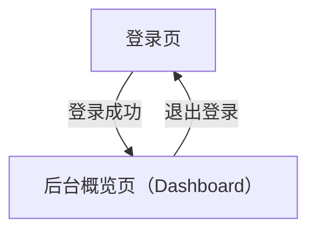

## 1. Product Overview
你要实现一套「管理后台 Web UI + 数据接口」，可按截图做到像素级还原。
当前会话仅收到 1 张截图（Dashboard/概览页）；其余 4 张截图待你补充后我再把对应页面补齐。

## 2. Core Features

### 2.1 User Roles
| 角色 | 注册/获取方式 | 核心权限 |
|------|--------------|----------|
| 后台用户（运营/管理员） | 账号密码登录（由系统预置/导入） | 登录后台、查看概览数据与列表 |

### 2.2 Feature Module
本产品（当前已确认）由以下页面构成：
1. **登录页**：账号密码表单、校验与错误提示、登录态建立。
2. **后台概览页（Dashboard）**：侧边导航、顶部栏、KPI 指标卡、趋势图表、来源分布、最新订单列表。

### 2.3 Page Details
| Page Name | Module Name | Feature description |
|-----------|-------------|---------------------|
| 登录页 | 登录表单 | 输入账号/密码并提交；校验必填；展示错误信息；成功后跳转后台概览页 |
| 登录页 | 登录态 | 保存 token/会话；刷新后保持登录；退出登录清理会话 |
| 后台概览页（Dashboard） | 全局框架 | 展示左侧导航与顶部栏；展示当前登录用户信息；提供退出入口 |
| 后台概览页（Dashboard） | KPI 指标卡 | 拉取并展示核心指标（数值、环比/同比、趋势箭头/颜色） |
| 后台概览页（Dashboard） | 趋势图表 | 拉取时间序列并绘制折线/面积图；支持按时间范围刷新 |
| 后台概览页（Dashboard） | 来源分布 | 拉取并展示来源占比（饼图/环图 + 图例） |
| 后台概览页（Dashboard） | 最新订单表 | 拉取最新记录；展示状态；支持基础分页/加载更多（如截图存在） |

## 3. Core Process
- 后台用户流：打开登录页 → 输入账号/密码 → 登录成功建立会话 → 进入 Dashboard → 页面并行加载 KPI/图表/列表数据 → 用户可退出登录返回登录页。

