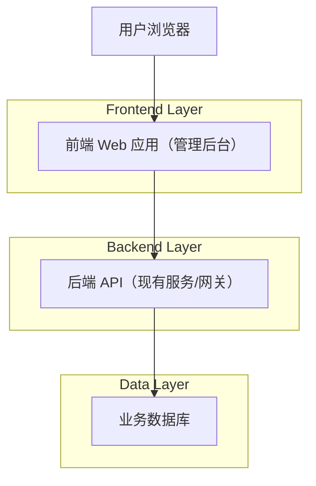
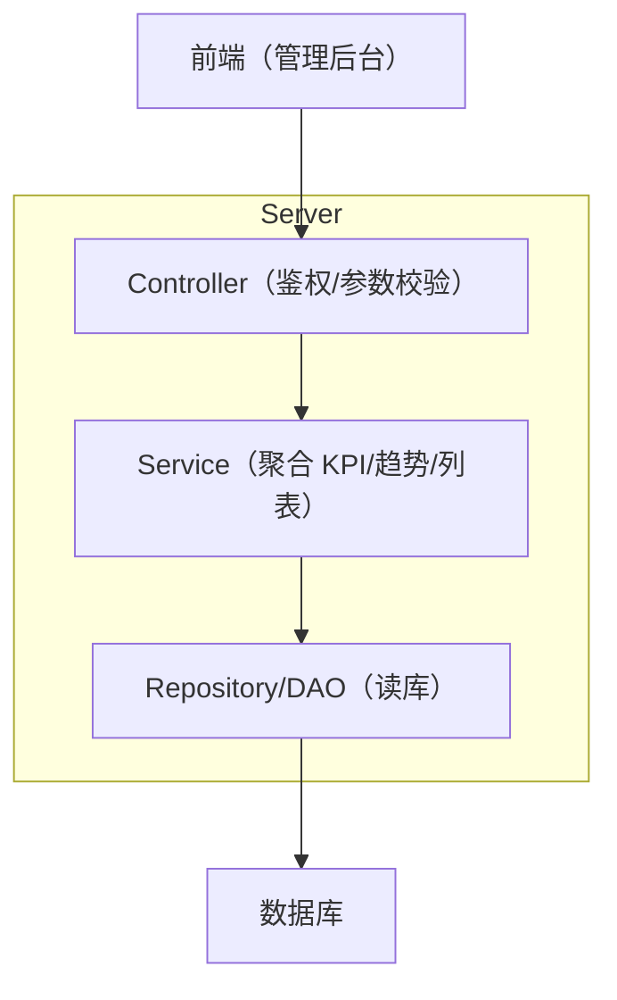

## 1.Architecture design


## 2.Technology Description
- Frontend: React@18 + TypeScript + Vite + TailwindCSS（或等价 CSS 方案） + ECharts（图表）
- Backend: 现有 Java/Spring Boot REST API（建议统一以 /api 前缀暴露）

## 3.Route definitions
| Route | Purpose |
|-------|---------|
| /login | 登录页，建立登录态 |
| /admin/dashboard | 概览页，展示 KPI/图表/列表 |

## 4.API definitions (If it includes backend services)
> 约定：除 /api/auth/login 外，其它接口均需 `Authorization: Bearer <token>`。

### 4.1 TypeScript 共享类型（前后端对齐）
```ts
export type ApiResp<T> = { code: number; message: string; data: T };

export type AdminMe = {
  id: string;
  name: string;
  avatarUrl?: string;
};

export type KpiCard = {
  key: 'activeUsers' | 'installed' | 'downloads' | 'revenue';
  title: string;
  value: number;
  unit?: string;
  deltaPct?: number; // +12.3 表示环比/同比
};

export type TimePoint = { date: string; value: number };

export type TrafficSourceItem = { source: string; value: number; pct: number };

export type OrderStatus = 'paid' | 'pending' | 'refunded' | 'failed';
export type OrderRow = {
  id: string;
  customerName: string;
  createdAt: string;
  amount: number;
  currency: string; // "USD"/"CNY"
  status: OrderStatus;
};
```

### 4.2 接口清单（请求/响应/示例）

#### 1) 登录
`POST /api/auth/login`
- Request(JSON): `{ "username": "admin", "password": "123456" }`
- Response(JSON): `{ "code":0,"message":"ok","data":{ "token":"<jwt>","expiresIn":7200 } }`

#### 2) 获取当前登录用户
`GET /api/admin/me`
- Response(JSON): `{ "code":0,"message":"ok","data":{ "id":"u_1","name":"Admin","avatarUrl":"https://..." } }`

#### 3) Dashboard - KPI 指标
`GET /api/admin/dashboard/kpis?range=30d`
- Response(JSON): `{ "code":0,"message":"ok","data":[ {"key":"activeUsers","title":"Active Users","value":18765,"unit":"","deltaPct":2.6} ] }`

#### 4) Dashboard - 活跃趋势（折线/面积图）
`GET /api/admin/dashboard/active-users?range=30d`
- Response(JSON): `{ "code":0,"message":"ok","data":[ {"date":"2026-04-01","value":1200} ] }`

#### 5) Dashboard - 来源分布（环图/饼图）
`GET /api/admin/dashboard/traffic-sources?range=30d`
- Response(JSON): `{ "code":0,"message":"ok","data":[ {"source":"Direct","value":4200,"pct":0.35} ] }`

#### 6) Dashboard - 最新订单列表
`GET /api/admin/dashboard/latest-orders?limit=10&cursor=`
- Response(JSON): `{ "code":0,"message":"ok","data":{ "items":[ {"id":"ORD-10001","customerName":"Courtney Henry","createdAt":"2026-04-21T09:10:00Z","amount":83.74,"currency":"USD","status":"paid"} ],"nextCursor":"..." } }`

#### 7) 退出登录
`POST /api/auth/logout`
- Response(JSON): `{ "code":0,"message":"ok","data":true }`

## 5.Server architecture diagram (If it includes backend services)

