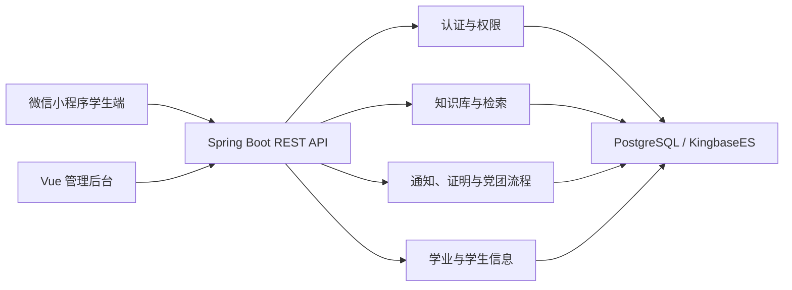

# 学院学生综合服务与党团管理平台

面向学院学生工作场景的一体化课程项目，包含 Spring Boot 后端、Vue 管理后台和原生微信小程序学生端。平台围绕政策检索、通知触达、证明申请、党团流程、学业分析和学生信息管理等需求，提供统一的业务接口与演示流程。

> 本项目由团队协作完成，用于课程展示与功能验证，不代表学校正式业务系统。

## 功能概览

- 账号登录、JWT 鉴权与多级角色权限；
- 学生信息、状态轨迹与画像管理；
- 政策知识库、模板下载和站内检索；
- 通知公告、标签化分发与阅读状态；
- 证明申请、审批、撤回和进度查询；
- 党团流程、时间线与待办提醒；
- 学业分析、预警与人工复核提示；
- 数据导入、错误明细、操作日志与平台审计。

## 系统组成

```text
.
├── src/                    # Spring Boot 后端
├── frontend/               # Vue 3 管理后台
├── student-mini/           # 原生微信小程序学生端
├── db/                     # 数据库结构、迁移与桥接脚本
├── scripts/                # 初始化与冒烟验证脚本
├── images/                 # 项目界面截图
└── 需求整合/               # 课程需求与阶段性说明
```



## 界面示例

| 学生端首页 | 知识检索 |
| --- | --- |
|  |  |

更多页面截图见 [`images/`](images/)。

## 技术栈

- 后端：Java 17、Spring Boot 3、Spring Security、Spring Data JPA、Flyway；
- 数据库：PostgreSQL；通过 PostgreSQL 协议兼容 KingbaseES；
- 管理后台：Vue 3、Vue Router、Pinia、Element Plus；
- 学生端：原生微信小程序；
- 接口文档：Springdoc OpenAPI / Swagger UI；
- 测试：JUnit、Spring Boot Test、MockMvc。

## 快速运行

### 1. 后端 Mock 模式

需要 JDK 17 或更高版本以及 Maven。

```bash
mvn spring-boot:run -Dspring-boot.run.profiles=mock
```

启动后可访问：

- Swagger UI：<http://localhost:8080/swagger-ui.html>
- 健康检查：<http://localhost:8080/actuator/health>

演示账号：

| 身份 | 用户名 | 密码 |
| --- | --- | --- |
| 管理员 | `admin` | `123456` |
| 辅导员 | `teacher01` | `123456` |
| 团支书 | `2023100002` | `123456` |
| 学生 | `2023100001` | `123456` |

### 2. Vue 管理后台

```bash
cd frontend
npm install
npm run serve
```

前端环境变量示例见 [`frontend/.env.example`](frontend/.env.example)。

### 3. 微信小程序

使用微信开发者工具打开 `student-mini/`，配置自己的 AppID 和后端合法域名后编译运行。详细说明见 [`student-mini/README.md`](student-mini/README.md)。

## 真实数据库模式

项目默认配置面向 KingbaseES 联调。相关文件包括：

- [`db/kingbase_schema.sql`](db/kingbase_schema.sql)：统一数据库结构；
- [`db/kingbase_backend_bridge.sql`](db/kingbase_backend_bridge.sql)：新旧领域表的初始化兼容桥接；
- [`scripts/init-kingbase-bridge.sh`](scripts/init-kingbase-bridge.sh)：数据库初始化脚本；
- [`src/main/resources/application-kingbase.yml`](src/main/resources/application-kingbase.yml)：Kingbase profile 配置。

示例：

```bash
DB_HOST=127.0.0.1 \
DB_PORT=54321 \
DB_NAME=student_service_platform \
DB_USER=postgres \
DB_PASSWORD=postgres \
LOAD_SAMPLE_DATA=true \
bash scripts/init-kingbase-bridge.sh

mvn spring-boot:run -Dspring-boot.run.profiles=kingbase
```

桥接脚本用于课程项目阶段的兼容联调，是从统一新表向现有后端依赖表进行初始化导入，不提供双向同步。

## 检索模块

站内检索对查询进行中文分词、同义词扩展和规则加权，并结合内容类型、关键词覆盖度等信号排序。示例同义词组包括：

```text
保研 / 推免 / 推荐免试
综测 / 综合测评 / 德育分
在读证明 / 盖章申请 / 开证明
辅导员 / 导员 / 班主任
```

相关配置位于 [`src/main/resources/application.yml`](src/main/resources/application.yml)，排序支持代码位于 `src/main/java/edu/ruc/platform/common/support/`。

## 测试

```bash
mvn test
```

现有集成测试覆盖认证与非法 Token、管理端统计与审批、学生通知、知识库检索、证明申请、党团进度、学业分析及部分异常流程。

已启动服务时，也可以执行：

```bash
./scripts/smoke-test.sh
```

## 当前边界

- 微信登录尚未接入学校真实身份系统；
- 部分模块在 Mock 模式下使用演示数据；
- KingbaseES 桥接属于阶段性兼容方案，部分扩展模块仍依赖历史表；
- 精准推送调度、复杂统计口径和部分文件解析能力仍需继续完善；
- 学业分析只提供辅助提示，不输出自动毕业判断等高风险结论。

更完整的接口、数据库和团队协作资料保留在仓库内的专项文档中，根 README 只提供项目概览与最小运行路径。
