# 小程序使用指南

**项目名称**：学院学生综合服务与党团管理平台
**系统名称**：学生端小程序
**版本号**：v1.0
**日期**：2026年05月26日

> 由于学业分析作为拓展模块，现在仍在开发过程中，故暂不予以开放测试

---

## 1. 文档说明

### 1.1 编写目的

本手册旨在指导学生用户快速熟悉并正确使用“学院学生综合服务与党团管理平台”学生端小程序，帮助学生高效办理日常事务、查询政策通知及跟进个人学业与党团进度。

### 1.2 适用对象

本学院全体在校本科生及研究生，约 1200 人

### 1.3 文档版本信息

当前版本为 v1.0，为小程序初始发布版本的配套操作手册。

### 1.4 使用约定说明

- 【】代表页面上的按钮或功能入口，如点击【提交申请】。
- 本手册中涉及的截图均为示例，具体以小程序实际显示为准。

## 2. 系统简介

### 2.1 系统概述

本系统是面向学院学生的“一站式”校园综合服务微信小程序，旨在实现事务办理电子化、政策咨询智能化、信息推送精准化、奖励荣誉展示等，提升老师管理效率和学生办事体验。

### 2.2 主要功能

包含：智能问答与政策知识库、党团事务流程管理、学生画像与信息管理、奖励荣誉展示、通知与消息触达等模块，学业情况分析与预警作为后续拓展模块。

### 2.3 用户角色说明

- **学生用户**：小程序的唯一使用群体，通过绑定学号 + 密码进行验证。

## 3. 运行与使用环境

### 3.1 支持平台

微信小程序端（支持 iOS 和 Android 系统）。

### 3.2 登录方式

微人大账号（学号/工号）绑定 + 密码验证

### 3.3 演示账号

请微信联系**zcy2018410420**

## 4. 系统整体结构

### 4.1 功能模块结构

系统底部提供三个固定导航栏标签：

- 【首页】
- 【消息】
- 【我的】

其中：

- **首页**：提供搜索入口、八大核心服务入口、待办进度和精选通知。
- **消息**：集中展示待办通知、反馈通知和个性化通知。
- **我的**：集中展示个人资料、我的申请、我的档案、我的工单、反馈入口、设置等功能。

### 4.2 首页八大核心服务入口

首页当前集成 8 个高频服务入口：

1. 政策库
2. 模板下载
3. 证明申请
4. 党团流程
5. 学业分析
6. 荣誉展示
7. 通知聚合
8. 常见问题

### 4.3 页面导航说明

- 点击底部导航栏可在【首页】【消息】【我的】之间切换。
- 点击首页功能区或“我的”页面中的功能项，可进入对应业务页面。
- 所有非 Tab 页业务页面均可通过左上角返回按钮回到上一层。
- 部分消息卡片和待办卡片可直接跳转到相应业务页面。

### 4.4 权限说明

- 学生需先完成登录方可使用大多数业务功能。
- 系统会结合学生的基础身份信息，为用户展示个人相关的通知、档案、办事记录与流程内容。

---

## 5. 用户操作指南

### 5.1 登录与身份绑定

#### 功能介绍

首次进入小程序时，需要完成学生身份绑定与登录。登录成功后，系统会同步当前用户的登录状态，并进入首页工作台。

#### 操作步骤

1. 首次进入系统时，页面将自动跳转到登录页。
2. 在“学号”输入框中输入学号。
3. 在“密码”输入框中输入登录密码，演示环境初始密码为 `123456`。
4. 检查信息无误后，点击【登录】。
5. 系统验证成功后，自动进入【首页】。

#### 注意事项

- 学号、密码均不能为空。
- 密码长度需满足系统校验要求。
- 若连续多次登录失败，系统会进行短时限制（20s），请稍后重试。

---

### 5.2 首页工作台

#### 功能介绍

首页是小程序的核心工作区，汇集了 8 大核心高频服务入口（智能检索、政策库、模板下载、证明申请、党团流程、学业分析、通知聚合、常见问题）以及待办进度、精选通知，方便快速直达所需服务。

#### 页面组成

- 顶部搜索栏

- Banner 展示区

- 八大核心功能入口

- 待办进度

- 精选通知

  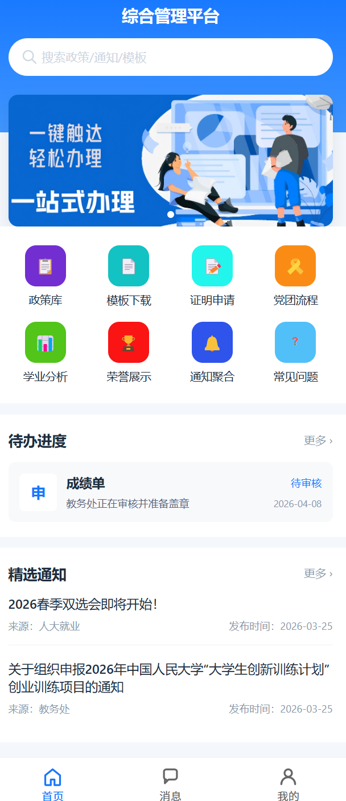

#### 操作说明

1. 点击顶部搜索栏，可进入【智能检索】页面。
2. 点击首页宫格入口，可进入相应业务模块。
3. 在【待办进度】区域中点击卡片，可快速跳转到对应事项。
4. 在【精选通知】区域中点击通知，可进入消息详情页查看全文。

#### 八大功能入口说明

- **政策库**：用于查看政策文件、通知公告。
- **模板下载**：用于查看并下载常用模板。
- **证明申请**：用于提交证明类办事申请。
- **党团流程**：用于查看入团、入党相关流程进展。
- **学业分析**：用于上传成绩单并查看学业分析结果。
- **荣誉展示**：查看公开个人/集体获奖情况。
- **通知聚合**：跳转至消息中心查看通知。
- **常见问题**：用于查看 FAQ 或提交工单咨询，团委老师等人会予以解答。

---

### 5.3 智能检索

#### 功能介绍

智能检索用于统一查询政策、通知、问答、模板内容，是首页顶部搜索和知识查询的重要入口。

#### 操作步骤

1. 在首页点击顶部搜索栏的【智能检索】，进入【智能检索】页面。

   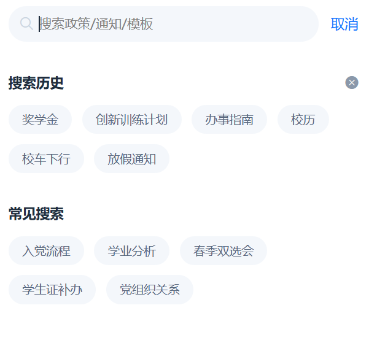

2. 在输入框中输入关键词，如“奖学金”“请假”“成绩单”“党员发展”等。

3. 可使用系统提供的历史记录、热门关键词或分类标签进行快速筛选。

   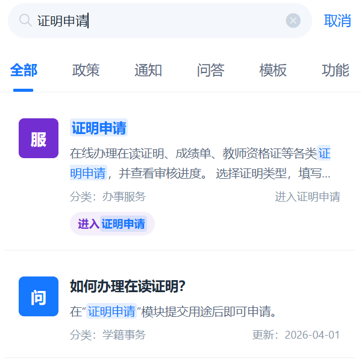

4. 点击搜索结果后，系统将根据结果类型跳转至对应页面，例如政策详情、通知详情、模板页面或申请详情。

#### 使用建议

- 关键词尽量简洁明确，如“奖助学金”“证明模板”“毕业手续”。
- 若搜索后仍未找到结果，可进入【常见问题】页发起工单咨询。

---

### 5.4 政策库

#### 功能介绍

本模块用于集中查看政策文件、通知公告以及办事模板资料。

#### 操作步骤

1. 在首页点击【政策库】。

2. 进入列表页后，可在不同标签页之间切换查看：
   - 政策文件
   
   - 通知通告
   
   - 模板下载
   
     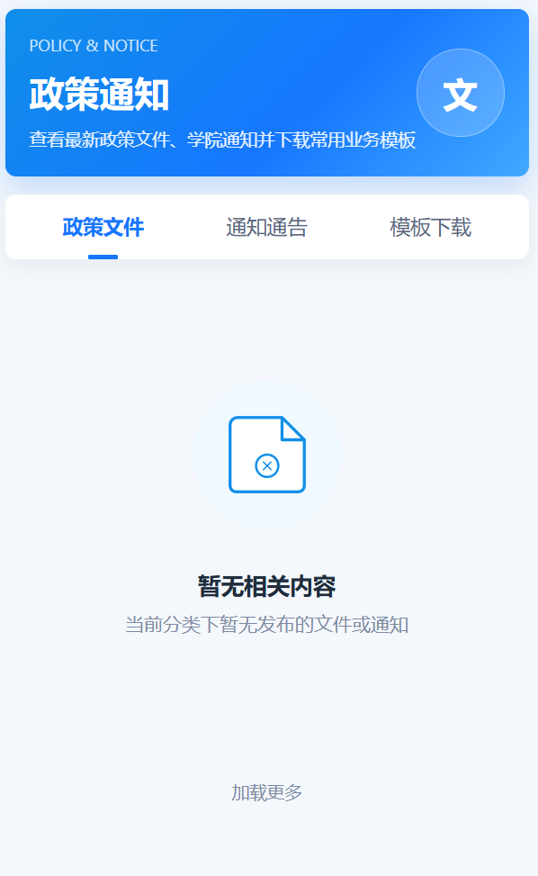
   
3. 点击某条政策或通知，可进入详情页查看正文内容。

4. 若为模板资料，可进入模板页查看模板名称、说明，并执行下载操作。

#### 适用场景

- 查询学院办事制度和文件依据
- 查看最新通知公告
- 下载证明、申请、备案等常用文书模板

#### 注意事项

- 模板下载前请确认模板版本是否为当前最新版本。
- 部分通知和政策内容可能包含附件，请根据页面提示查看或下载。

---

### 5.5 模板下载

#### 功能介绍

本模块用于查看并下载模板。

#### 操作步骤

1. 在首页点击【模板下载】。

2. 进入列表页后，可在不同模板之间滑动切换查看并下载，也可以通过模板列表点击以滑动到所要查看的模板。

   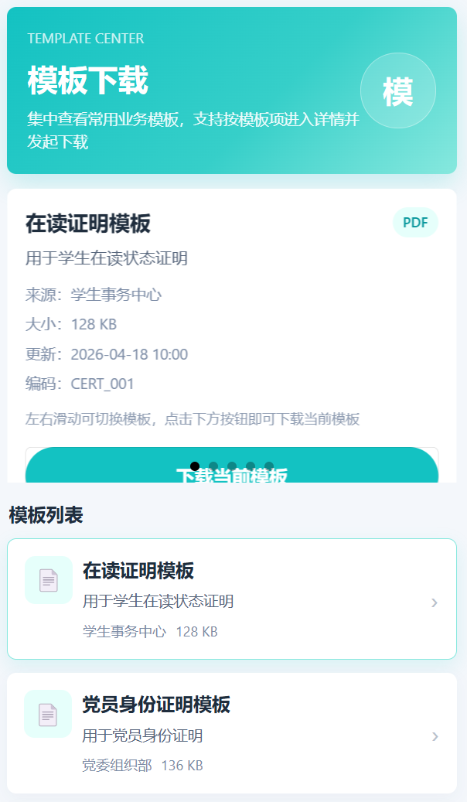

3. 点击【下载当前模板】即可下载

****

### 5.5 证明申请

#### 功能介绍

证明申请模块用于在线发起各类证明、材料或办事申请，并跟踪处理状态。

#### 支持操作

- 查看我的申请列表
- 发起新申请
- 保存草稿
- 提交正式申请
- 查看申请详情
- 在允许条件下撤回申请

#### 操作步骤

1. 在首页点击【证明申请】，或在【我的】页面点击【我的申请】。

2. 进入申请列表后，可查看已提交记录及当前状态。

   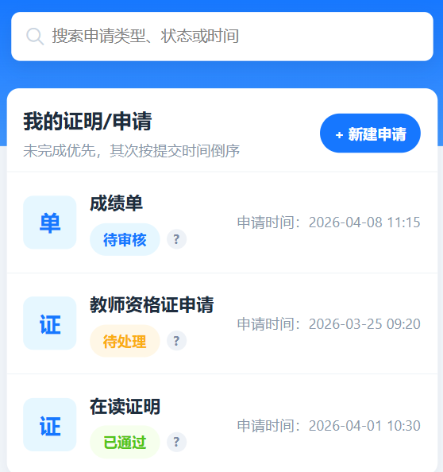

3. 点击【新建申请】进入申请填写页面。

   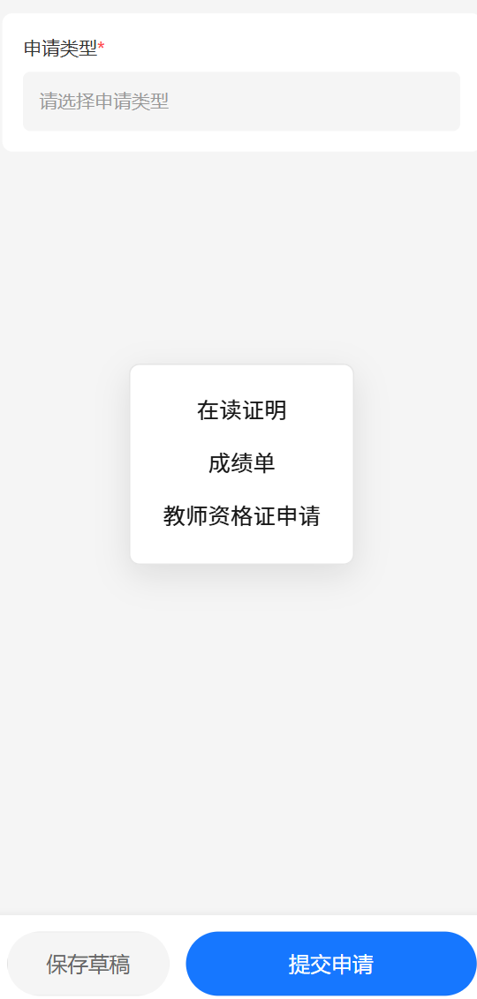

4. 选择申请类型，填写用途说明、备注等内容。

   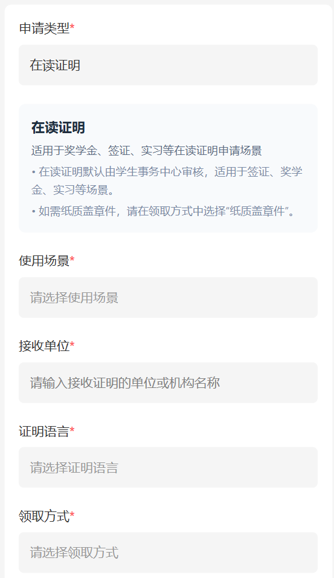

5. 如有需要，可上传附件材料。

6. 可选择：
   - 点击【保存草稿】，暂不提交
   - 点击【提交申请】，提交至系统处理

7. 提交成功后，可在申请列表中查看状态变更。

#### 常见状态说明

- 待提交
- 审核中
- 已通过
- 已驳回
- 已撤回

#### 使用建议

- 提交前请认真核对申请类型与用途说明。
- 如页面允许撤回，请在处理完成前及时操作。

---

### 5.6 党团流程

#### 功能介绍

党团流程模块用于展示学生当前的入团、入党流程状态，帮助学生了解自己处于哪个阶段、下一步需要完成什么事项。

#### 操作步骤

1. 在首页点击【党团流程】。
2. 进入后可查看党团流程总览。
3. 页面支持在不同流程类型之间切换查看（但如要查看入党流程，要先完成全部入团流程节点），如：
   - 入团流程
   - 入党流程
4. 点击对应流程后，可查看当前流程进度、阶段说明和相关提示。

#### 注意事项

- 当前页面主要用于进度查看与状态展示。
- 若系统提示当前条件未满足，可能暂不支持进入下一阶段流程查看。

---

### 5.7 学业分析

#### 功能介绍

学业分析模块用于上传成绩单文件，并根据成绩数据生成学业概览与分析报告。

#### 支持操作

- 查看成绩单状态
- 上传成绩单
- 查看学业概览
- 查看学业分析报告

#### 操作步骤

1. 在首页点击【学业分析】。

2. 首次进入时，若系统检测到暂无可用成绩单，将提示先上传文件。

   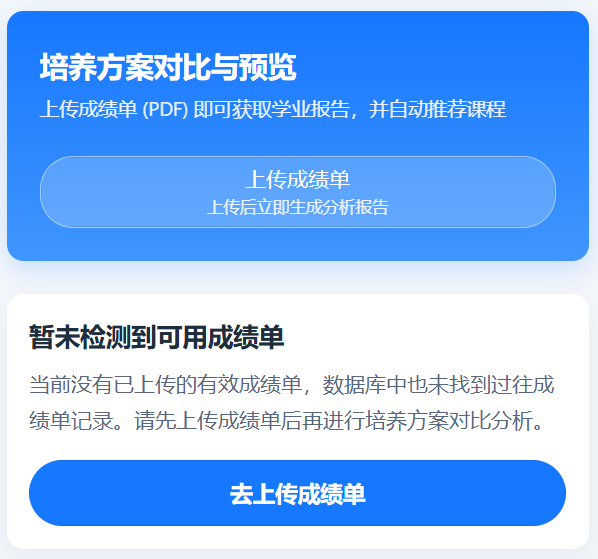

3. 点击【上传成绩单】进入上传页面。

   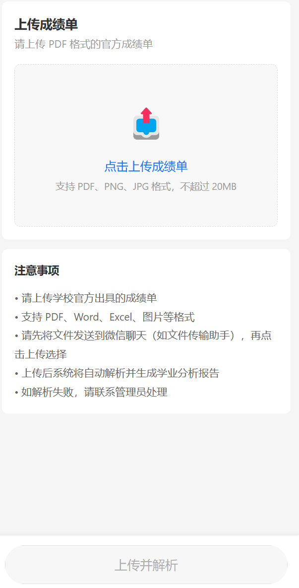

4. 按页面提示从微信会话或本地可选文件中选择成绩单文件。

5. 上传成功后，系统将生成学业分析结果。

6. 返回学业分析首页，点击【查看报告】进入详细分析页。

#### 注意事项

- 上传前请确认文件内容为本人有效成绩单。
- 若未上传成绩单，系统无法生成完整学业报告。
- 上传失败时，请检查网络状态和文件格式后重试。

---

### 5.8 荣誉展示

#### 功能介绍

系统支持荣誉展示相关页面，用于展示学生个人或集体荣誉信息、荣誉详情及获奖者信息。

#### 可查看内容

- 荣誉列表
- 荣誉详情
- 获奖者信息

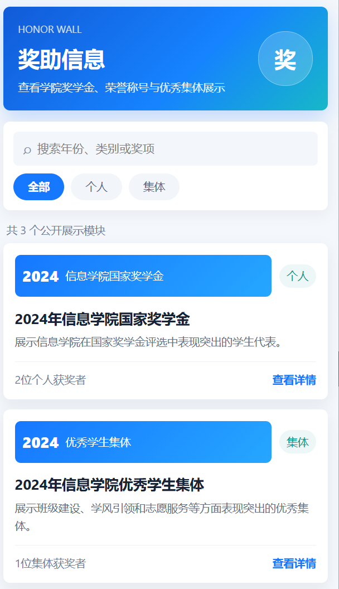

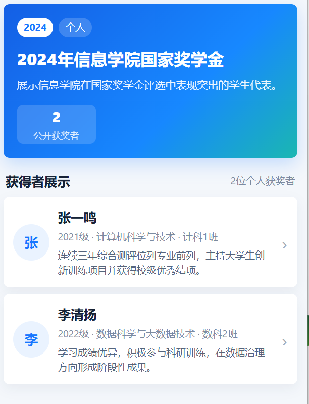

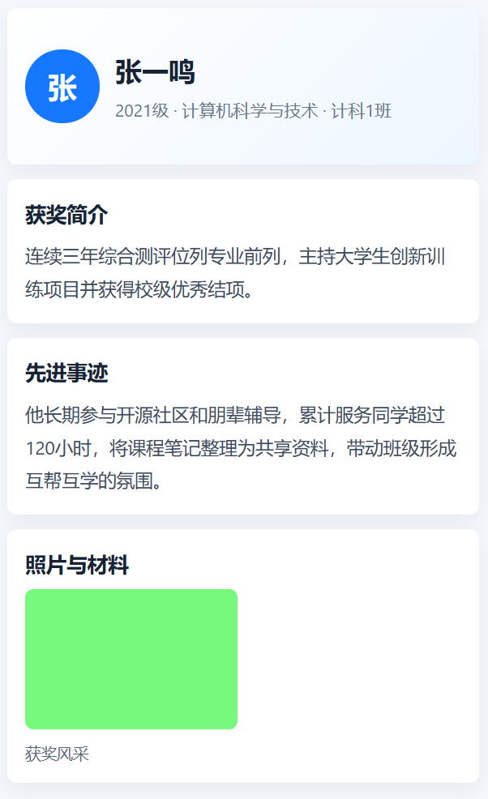

****

### 5.9 消息中心

#### 功能介绍

消息中心用于集中展示系统推送给学生的各类通知消息，当前主要包括：

- 待办通知

- 反馈通知

- 个性化通知

  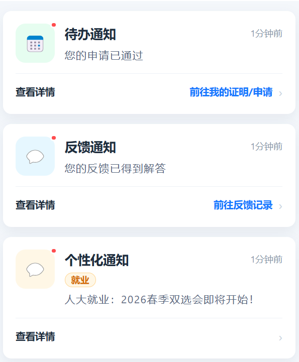

#### 操作步骤

1. 点击底部导航栏【消息】或通过首页八大功能区【通知聚合】或通过首页精选通知栏进入消息中心。

2. 在消息列表中查看消息标题。

3. 点击消息卡片可进入详情页。

   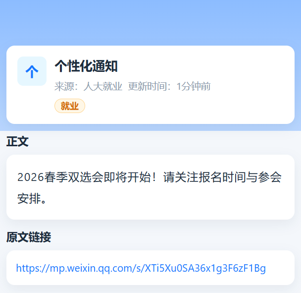

4. 若消息中带有业务跳转按钮，可直接前往对应页面，例如：
   - 我的申请
   - 反馈记录
   - 其他业务页面

#### 适用场景

- 查看申请处理结果
- 查看反馈处理结果
- 接收学院个性化消息推送

---

### 5.10 我的

#### 功能介绍

【我的】页面是学生个人服务入口集合页，用于集中管理个人资料和常用功能入口。

#### 当前页面包含功能入口

- 我的档案
- 我的申请
- 我的工单
- 意见反馈
- 反馈记录
- 设置
- 关于我们
- 退出登录

#### 操作步骤

1. 点击底部导航栏【我的】。
2. 根据需要点击对应功能项进入业务页面。
3. 若需要退出当前账号，可点击页面底部【退出登录】。

#### 页面截图

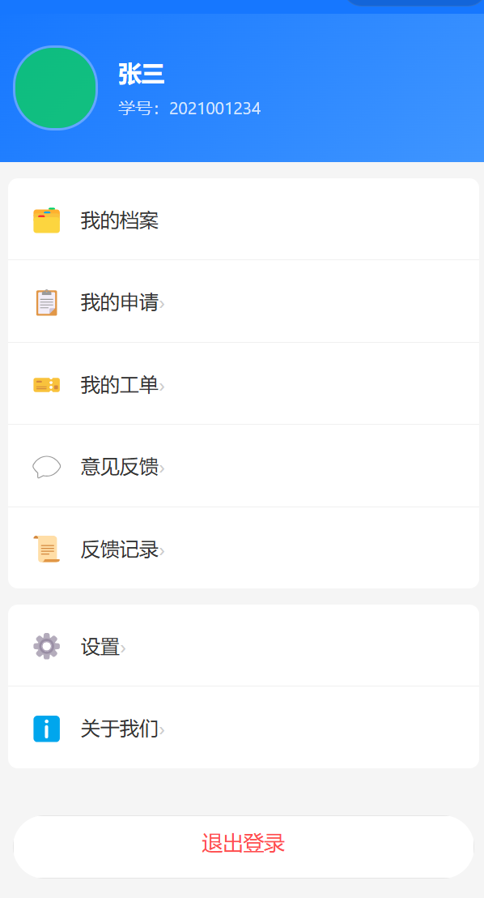

---

### 5.11 我的档案（成长档案）

#### 功能介绍

“我的档案”用于展示个人基础资料与成长记录，是学生成长档案的统一入口。

#### 页面内容

- 个人基础信息
- 身份标签信息
- 各类成长模块统计
- 模块记录数量

#### 操作步骤

1. 在【我的】页面点击【我的档案】。

2. 查看个人姓名、学号、专业、年级、班级等基础信息。

   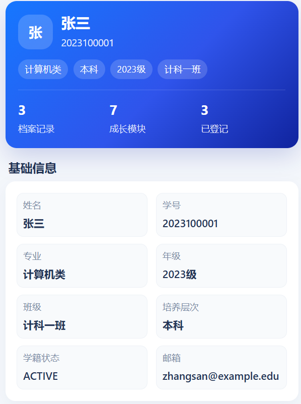

3. 查看成长档案模块概览。

   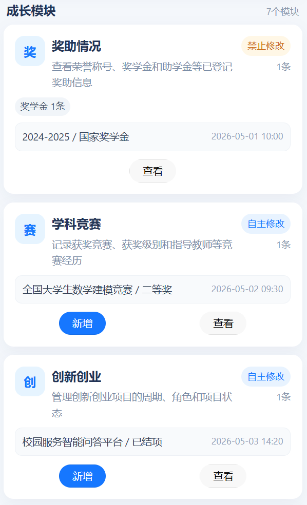

4. 点击某一档案模块进入记录管理页面。

5. 若当前模块支持学生自助维护，可点击新增或编辑进入表单页面。

#### 适用场景

- 查看个人基础档案
- 管理个人成长记录
- 查看奖助、经历、阶段性记录等档案信息

---

### 5.12 常见问题与工单

#### 功能介绍

常见问题模块用于查看系统整理的 FAQ 内容；若无法从 FAQ 中解决问题，学生可继续提交工单咨询。

#### 操作步骤

1. 在首页点击【常见问题】。

2. 在 FAQ 页面通过关键词搜索相关问题。

   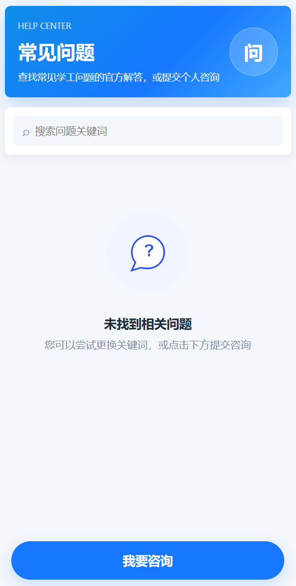

3. 点击问题条目可展开查看答案。

4. 若未找到需要的内容，可点击【我要咨询】进入工单提交页面。

   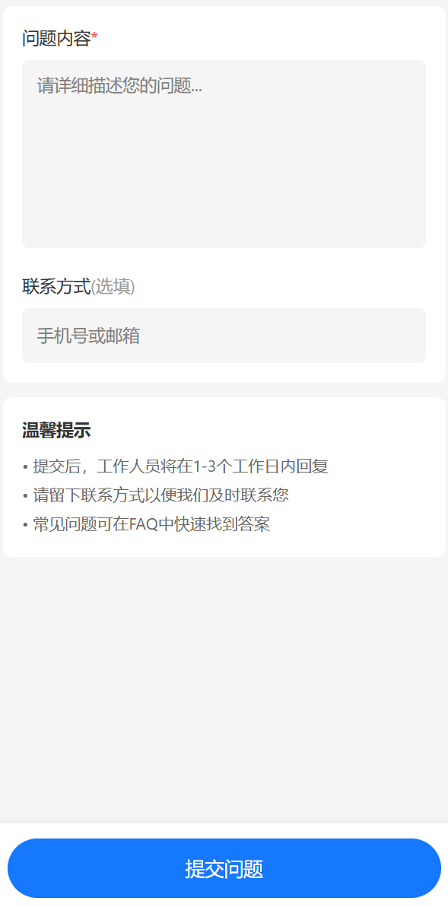

5. 填写问题内容和联系方式后提交。

6. 在【我的】页面点击【我的工单】查看已提交工单记录。

#### 使用建议

- 提交问题时尽量描述清楚问题背景、发生场景和期望帮助内容。
- 建议填写有效联系方式，便于后续沟通。

---

### 5.13 意见反馈与反馈记录

#### 功能介绍

意见反馈模块用于收集学生在使用过程中发现的问题、改进建议和其他意见；反馈记录页面用于查看本人历史反馈信息。

#### 反馈类型

- 功能异常
- 产品建议
- 其他问题

#### 操作步骤

1. 在【我的】页面点击【意见反馈】。

   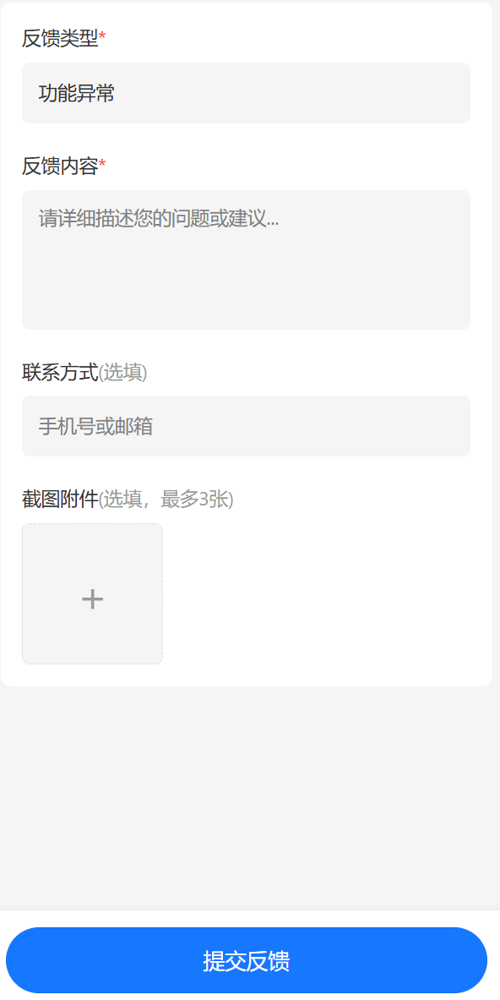

2. 选择反馈类型。

3. 填写反馈内容。

4. 如有需要，可填写联系方式。

5. 可上传图片附件，最多支持 3 张。

6. 点击【提交】完成反馈。

7. 返回【我的】页面，点击【反馈记录】查看历史反馈。

#### 注意事项

- 反馈内容不能为空，且建议填写完整具体。
- 若需要便于定位问题，建议附带截图。

---

### 5.14 设置、用户协议与隐私政策

#### 功能介绍

设置页面用于管理通知开关、缓存清理、版本检查以及查看协议说明。

#### 当前支持功能

- 系统通知开关
- 活动通知开关
- 消息通知开关
- 清除缓存
- 检查更新
- 查看用户协议
- 查看隐私政策

#### 操作步骤

1. 在【我的】页面点击【设置】。

   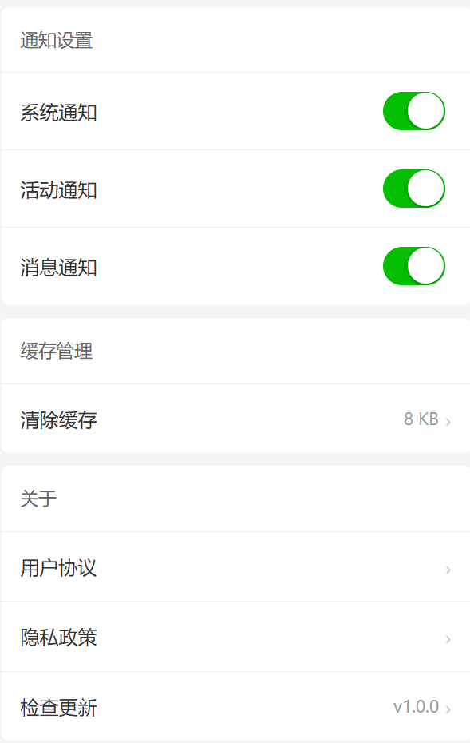

2. 按需开启或关闭通知项。

3. 若需要清理缓存，点击【清除缓存】并确认。

4. 若需查看规则说明，可点击【用户协议】或【隐私政策】。

5. 点击【检查更新】可查看当前是否为最新版本。

#### 注意事项

- 清除缓存后，系统会尽量保留当前登录信息与通知设置。
- 若遇到页面显示异常，可优先尝试清除缓存后重新进入。

---

### 5.15 关于我们与退出登录

#### 功能介绍

“关于我们”页面用于展示系统简介和开发团队相关说明；退出登录功能用于安全结束当前账号使用。

#### 操作步骤

1. 在【我的】页面点击【关于我们】查看系统介绍。
2. 如需退出当前账号，点击【退出登录】。
3. 在弹出的确认框中点击确认后，系统将返回登录页。

---

## 6. 常见问题

### 6.1 无法登录怎么办？

请依次检查：

- 姓名是否为真实姓名
- 学号是否输入正确
- 密码是否正确
- 网络是否正常

如仍无法登录，请联系【zcy2018410420】核实情况。

### 6.2 为什么进入学业分析后看不到报告？
【由于数据库尚在建设中，默认展示mock数据】
通常是因为当前尚未上传成绩单，或成绩单尚未成功解析。请先完成成绩单上传，再重新进入学业分析页面。

### 6.3 提交申请后在哪里查看进度？

可通过以下任一方式查看：

- 首页【待办进度】
- 【我的】->【我的申请】
- 【消息】中的待办通知

---

## 7. 使用注意事项

- 若发现系统页面异常、加载缓慢或数据未刷新，可先尝试重新进入页面或清除缓存。
- 本手册根据当前版本页面与功能整理，后续如有新增模块或页面调整，请以新版手册为准。
